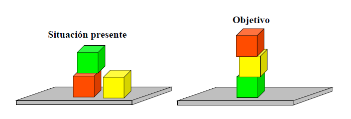

# Solución al problema "El mundo de los bloques" utilizando Búsqueda no Informada.

## Situaciones



## Formalización

Los cubos **verde**, **amarillo** y **rojo** serán representados con las letras **v**, **a** y **r** respectivamente.

El objetivo puede ser descrito como el estado de una pila ~~ubicado en la columna central~~.

La estructura que soporta el estado de la pila consta de **3** parametros. Cada parametro puede tomar uno de los siguientes valores:
- **0** para indicar que no tiene un cubo.
- **v**, **a** ó **r** para indicar el color del cubo.

### Formalización de los estados

-  **Estado Inicial :** (r,v,0)

-  **Estado Objetivo :** (v,a,r)

### Formalización de las acciones

Las acciones que se pueden aplicar sobre una pila son las de **apilar** y **desapilar**/**quitar** un elemento. Sin enmbargo, para este caso es necesario diferenciar el **color** del elemento y el **tamaño** de la pila. Entonces tendremos un total de **18** posibles acciones.

## Implementación

El siguiente código esta escrito utilizando el lenguaje Prolog.

```
solucion(A):- sgte(e(r,v,0), [e(r,v,0)], V , [], A).

sgte(e(v,a,r),V,V,A,A).
sgte(e(X,Y,Z),Lv,V,La,A):-
	accion(e(X,Y,Z), e(Xs,Ys,Zs), Acc),
	not(pertenece(e(Xs,Ys,Zs), Lv)),
	writeln(Acc),
	sgte(e(Xs,Ys,Zs), [e(Xs,Ys,Zs)|Lv], V, [Acc|La], A).

pertenece(X,[X|_]):-!.
pertenece(X,[_|R]):-pertenece(X,R).

% Acciones:

% Quitar bloque verde
accion(e(v,0,0), e(0,0,0), 'quita bloque verde').
accion(e(X,v,0), e(X,0,0), 'quita bloque verde').
accion(e(X,Y,v), e(X,Y,0), 'quita bloque verde').

% Quitar bloque amarillo
accion(e(a,0,0), e(0,0,0), 'quita bloque amarillo').
accion(e(X,a,0), e(X,0,0), 'quita bloque amarillo').
accion(e(X,Y,a), e(X,Y,0), 'quita bloque amarillo').

% Quitar bloque rojo 
accion(e(r,0,0), e(0,0,0), 'quitar bloque rojo').
accion(e(X,r,0), e(X,0,0), 'quitar bloque rojo').
accion(e(X,Y,r), e(X,Y,0), 'quitar bloque rojo').

% Apilar bloque verde
accion(e(0,0,0), e(v,0,0), 'apilar bloque verde').
accion(e(X,0,0), e(X,v,0), 'apilar bloque verde'):- X\=v.
accion(e(X,Y,0), e(X,Y,v), 'apilar bloque verde'):- X\=v, Y\=v.

% Apilar bloque amarillo
accion(e(0,0,0), e(a,0,0), 'apilar bloque amarillo').
accion(e(X,0,0), e(X,a,0), 'apilar bloque amarillo'):- X\=a.
accion(e(X,Y,0), e(X,Y,a), 'apilar bloque amarillo'):- X\=a, Y\=a.

% Apilar bloque rojo
accion(e(0,0,0), e(r,0,0), 'apilar bloque rojo').
accion(e(X,0,0), e(X,r,0), 'apilar bloque rojo'):- X\=r.
accion(e(X,Y,0), e(X,Y,r), 'apilar bloque rojo'):- X\=r, Y\=r.
```

## Prueba de escritorio
